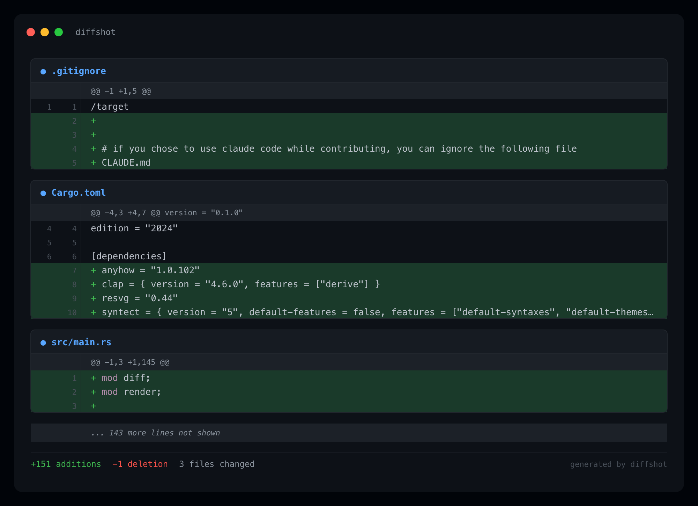

# diffshot

diffshot is a Rust CLI that takes a git diff and renders it as a presentable, shareable image

**[Installation](#installation) · [Usage](#usage) · [Options](#options) · [Examples](#examples) · [Contact](#contact) · [License](#license)**



*Example output from running diffshot on a real git diff.*

## Installation

**macOS / Linux**
```bash
curl --proto '=https' --tlsv1.2 -LsSf https://github.com/faisalfakih/diffshot/releases/latest/download/diffshot-installer.sh | sh
```

**Windows (PowerShell)**
```powershell
powershell -c "irm https://github.com/faisalfakih/diffshot/releases/latest/download/diffshot-installer.ps1 | iex"
```

**Via cargo**
```bash
cargo install diffshot
```

## Usage

```bash
diffshot [TARGET] [OPTIONS]
```

`TARGET` is an optional git ref or range. If omitted, diffshot renders your current uncommitted changes.

```bash
# Uncommitted changes
diffshot

# Diff between two branches
diffshot main..feat/auth

# Last 3 commits
diffshot HEAD~3
```

## Options

| Flag | Short | Description |
|------|-------|-------------|
| `--file <FILE>` | `-f` | Restrict the diff to a specific file |
| `--output <FILE>` | `-o` | Output filename. Extension sets the format: `png`, `jpg`, `jpeg`, `svg` (default: `diffshot.png`) |
| `--dir <DIR>` | `-d` | Directory to write output into (default: current directory) |
| `--max-lines <N>` | `-l` | Truncate the entire diff at N total lines |
| `--max-lines-per-chunk <N>` | `-L` | Truncate each `@@` chunk/hunk independently at N lines (shows a footer per truncated chunk) |
| `--resolution <N>` | `-r` | Pixel scale multiplier for output resolution (default: `2`) |
| `--split` | `-s` | Render each changed file as a separate image |
| `--no-highlight` | | Disable syntax highlighting |
| `--compact` | | Render all hunks of a file in one block (default: each chunk gets its own block) |

## Examples

```bash
# Diff of a specific file vs main
diffshot main --file src/main.rs

# Save as SVG into an exports folder
diffshot HEAD~1 --output diff.svg --dir exports/

# High-res PNG, split per file
diffshot main..dev --split --resolution 3

# Cap at 100 lines, no syntax highlighting
diffshot --max-lines 100 --no-highlight

# Cap each chunk at 50 lines (each @@ hunk gets its own truncation footer)
diffshot --max-lines-per-chunk 50
```

## Contact

[me@faisalfakih.com](mailto:me@faisalfakih.com)

## License

MIT © [Faisal Fakih](https://github.com/faisalfakih)
